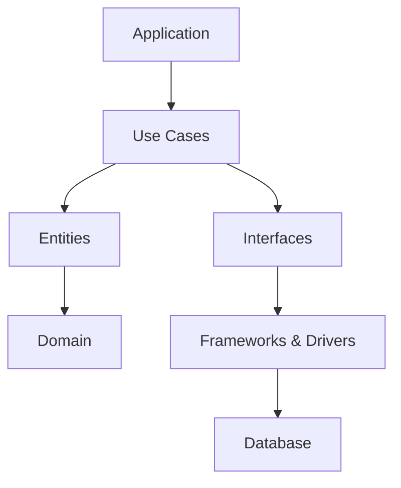
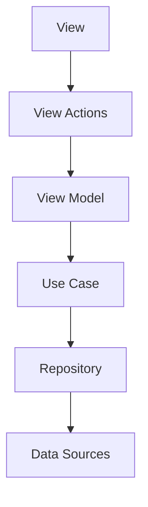

# BMSAssignment
Assignment done as part of the first round at BookMyShow

## Details

The assignment involves using the [TMDB Api](https://developers.themoviedb.org/3/getting-started) to fetch details for a movie and make a dummy button titled 
"Book Details" which navigates to another screen that will be used to book the tickets

### Tech Stack / Third Party libraries used

- 100% Kotlin
- Kotlin Coroutines and Flows for asynchronous operations
- Koin for dependency injection
- Ktor Client for network related operations
- AndroidX Navigation, Lifecyle and ViewModel
- Jetpack Compose

### Architecture

- I have used the Clean Architecture for developing the single screen. Scalability has been kept in mind and the architecture used is very suitable for independent
feature development i.e. you can split every feature into a seperate module and any individual team can work on it

- I have also made use of Unidirectional Data Flow. The unidirectional flow of data ensures that data is handled consistently and predictably throughout the application, reducing the potential for bugs and making the code easier to reason about and maintain.
   

**"Data Flows Up and Events go Down"**

### Screenshots

<kbd></kbd>

